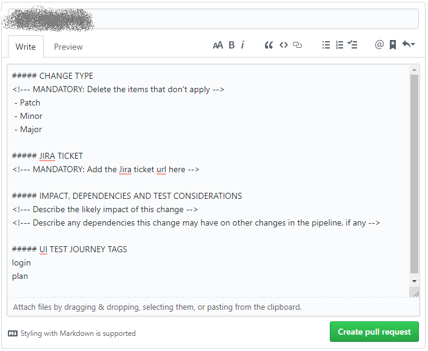

# Markers
Markers are used to associate related classes by area of application. If a test touches on one of these areas of the application then the test should have that marker. This is to allow a test run for a changeset that is percieved to change a certain set of areas of the system.

The following markers are the only markers that are allowed (please update as appropriate).

| Intelligent Office | PFP | DevHub | iOStore | API |
|---|---|---|---|---|
|io_all|pfp|devhub|||
|assureweb|pfp_login|devhub_login|||
|cash_receipt|||||
|client|||||
|datauploader|||||
|delegation|||||
|document|||||
|documentdesigner|||||
|dynamic_planner|||||
|factfind|||||
|factfind_pdf|||||
|fee|||||
|file_checking|||||
|fund|||||
|iostore|||||
|lead|||||
|login|||||
|model_portfolio|||||
|mortgage_brain|||||
|organiser|||||
|payment|||||
|plan|||||
|portfolio_report|||||
|post_submission|||||
|pre_submission|||||
|quote|||||
|recommendation|||||
|reports|||||
|scheme|||||
|statement|||||
|subplan|||||
|tag|||||
|unipass|||||
|uploaddocument|||||
|valuation|||||
|withdrawal|||||
|workflow|||||

The screenshot below shows how multiple markers can be used in a PR Template:

